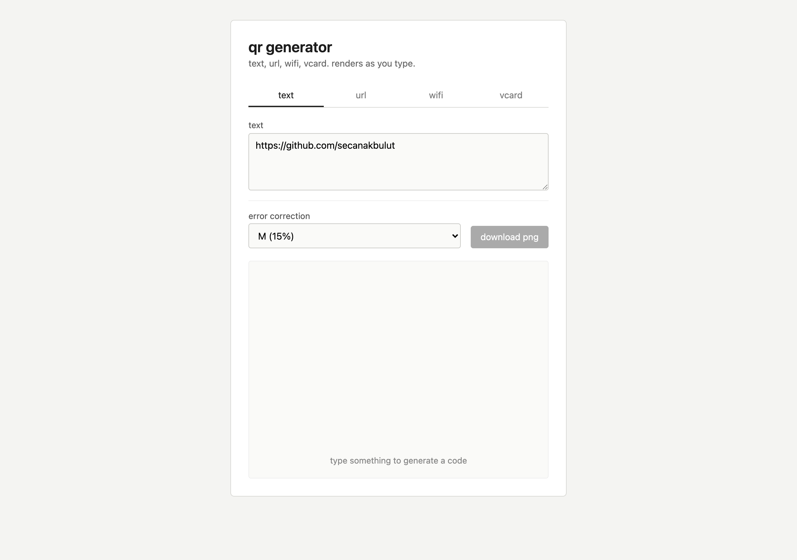

# qr-generator



small browser tool for making qr codes. supports plain text, urls, wifi credentials, and vcard contacts. renders live to a canvas and lets you save the result as a png.

i needed one for printing wifi cards for an airbnb and got tired of the ad-stuffed sites, so i wrote my own in an evening.

## what it does

- four input modes via tabs: text, url, wifi, vcard
- wifi mode builds the standard `WIFI:T:WPA;S:ssid;P:pass;;` payload that ios and android both recognize
- vcard mode uses vcard 3.0
- adjustable error correction (L / M / Q / H)
- download the rendered code as a png

## running it

no build step, no dependencies to install.

```
open index.html
```

or serve the folder with anything (`python3 -m http.server`, the live-server extension, etc). qrcode.js loads from a cdn.

## stack

vanilla html, css, js. [qrcode.js 1.5.3](https://github.com/soldair/node-qrcode) via jsdelivr does the actual encoding.

## files

- `index.html` markup and tabs
- `style.css` styles
- `app.js` payload builders and render loop
- the wifi escape function in `app.js` handles commas and semicolons in ssid or password, which trips up most online generators

## license

source-available under PolyForm Noncommercial 1.0.0. fine for personal use, not for resale or commercial products. see LICENSE.
